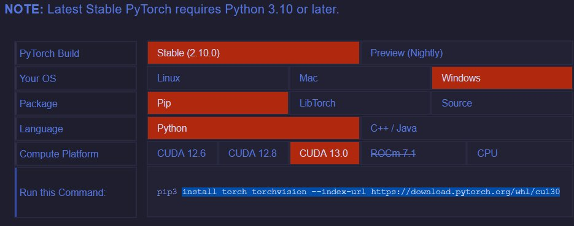

# Notes
- This guide was designed with a Windows client and a Raspberry Pi-based server in mind. These steps will vary on different operating systems.
- This guide will make use of angle brackets `<>` to denote part of a command that is left up to the user, like a name. An example is a file path e.g. `C:\Users\<user>\Downloads`. In this case, you would replace `<user>` with your Windows username e.g. `C:\Users\johndoe\Downloads`. The angle brackets themselves are usually **not** included unless explicitly specified.
- After installing a new program, always restart your terminal so that it updates with the location of the newly installed app. Otherwise you may get `command <program> not recognized` even though you just installed it.

# Requirements
> [!note]
> Python package requirements for each component will be discussed in their relevant sections

### Before installing Python, see [Python Install Manager](#python-install-manager-pim) below.

## Training
> [!tip] 
> CUDA-enabled GPU is strongly recommended for training but not required

- aarch64 (ARM) or x86-based machine (32-bit ARM platforms will not work!)
- NVIDIA CUDA Toolkit (if using CUDA)
- Any PyTorch-compatible version of Python

> [!important]
> See [PyTorch - Getting Started](https://pytorch.org/get-started/locally/) for currently supported CUDA and Python versions. It is important to install a version of CUDA that is supported by PyTorch. Otherwise, torch will use the CPU even if CUDA is installed.

## Client/Recording
- x86-based machine
- OpenNI-compatible camera (Examples: Kinect 360, PrimeSense Carmine 1.08/1.09)
- Windows 10 or 11
- Python 3.6
- [CMake v3.4.3](https://github.com/Kitware/CMake/releases/download/v3.4.3/cmake-3.4.3-win32-x86.exe)
- [OpenNI 2 from structure.io](https://web.archive.org/web/20250912105130/https://s3.amazonaws.com/com.occipital.openni/OpenNI-Windows-x64-2.2.0.33.zip)
- [PrimeSense NiTE 2.2](https://web.archive.org/web/20260305002027/https://bitbucket.org/kaorun55/openni-2.2/raw/2f54272802bfd24ca32f03327fbabaf85ac4a5c4/NITE%202.2%20%CE%B1/NiTE-Windows-x64-2.2.zip)
- Visual Studio 2022 (see [Visual Studio Requirements](#visual-studio-requirements) below)

> [!warning] 
> Many of these are specific versions for a reason:
> - Do not use the version of OpenNI provided by the BitBucket repository hosting NiTE 2.2. It will not run properly. Use the version from structure.io linked above.
> - You MUST use a version of CMake older than v3.5, otherwise some of your `pip` commands will fail.
> - Trying to run the client on versions of Python > 3.6 will fail. This is due to the outdated `openni` bindings package using deprecated features.

## Server
- aarch64 or x86-based machine (we used a Raspberry Pi 4)
- Any PyTorch-compatible version of Python
- Ethernet cable (if you are running the server on a separate device)
- Monitor, keyboard, and mouse (only needed during setup for the Pi)

## Python Install Manager (PIM)
> [!note] 
> This section is only required on the Windows machine. We will assume for this guide that the Pi is dedicated to this purpose and only needs one Python installation.

This guide assumes that you do not have a version of Python already installed. However, even if you do have it installed, Python Install Manager is recommended to keep track of multiple versions.

### Python Install Manager can be downloaded from the top of the Python downloads page: https://www.python.org/downloads/

The installer may ask a series of questions depending on your current Python installation:
- Do you want to edit app execution aliases? This option will open Settings > App execution aliases. If you previously installed Python, Windows will have set that installation as the default executable for the commands `python` and `python3`. PIM recommends that you switch this to its own `Python(default)` options, which will allow PIM to manage the default installation instead of Windows.
  
- If you had the legacy "Python Launcher" application installed, the PIM installer will warn you. PIM is a replacement for Python Launcher so it should be safe to uninstall it in most cases. This will prevent conflicts with the `py` command.

- Do you want to add Python shortcuts to your PATH? This option adds version-specific shortcuts e.g. `python3.11.exe`, `python3.6.exe` to your system's environment variables. **This is required to use these commands directly in Windows CMD/PowerShell.** Otherwise, you will have to reference the absolute path to the Python executable e.g. `C:\Users\<user>\AppData\Local\Python\pythoncore-3.11`.

- Do you want to install the latest Python runtime? If you already have a Python installation, you can skip this. We will be using PIM to install specific versions later anyway.

See the [Python install docs](https://docs.python.org/3/using/windows.html#python-install-manager) for more information.

After the PIM installer completes, you will have to restart your CMD/PowerShell window to use it. After reopening the CLI, you can type `py install <version>` to install a specific version. After installing, it will tell you how to reference that version e.g. `python3.6.exe` to access Python 3.6 instead of the default `python` command.

### As stated above, for this project, you will need to install two versions:
- A PyTorch supported version, e.g. `py install 3.11`
- Python 3.6, installed with `py install 3.6`

## Visual Studio Requirements
The setup scripts for some of the client dependencies make use of some Visual Studio build tools. Therefore, Visual Studio 2017 or later must be installed before setting up the client. **If you do not install VS, you will experience errors when trying to install some packages through `pip`!**

Download the Visual Studio Community Installer from [Microsoft's website](https://visualstudio.microsoft.com/vs/community/). Although this requires a Microsoft account, the Community edition **does NOT** require a subscription! During installation, make sure to check the `Desktop Development with C++` workload. This will install the necessary build tools.

# Setup
First we will set up the virtual environments, the training script, client and recording scripts (they share their dependencies so will use the same virtual environment), and finally the server.

> [!tip]
> If you've never used Linux/UNIX before, or at least not Linux and Windows in parallel, note that Windows uses **backslashes** `\` to denote paths e.g. `C:\Users\<user>\Downloads`, while Linux/UNIX filepaths use **forward slashes** `/` e.g. `/home/user/Downloads`. Keep this in mind when you are typing the commands from this guide.

## Downloading the files

There are two ways to get the files:

1. (Recommended) You can use [Git](https://git-scm.com/install/) to clone the repository directly from the command line.
2. You can also download the files directly from GitHub by navigating to the `<> Code` tab of the repository, clicking the green `<> Code` button in the top right next to the sidebar, and clicking `Download ZIP`. You'll need to extract this downloaded ZIP to the folder of your choice.

### Using Git

Start by navigating to the folder you want the repository to be placed inside:
```sh
cd <folder>
```

Note that the cloning process will create a folder of its own, so you don't need to create a new folder just to clone this repo. The next step is to clone the repo:
```sh
git clone https://github.com/ThatGiantSeth/skeleton-reID.git
```

This will create a folder called `skeleton-reID` that contains all of the files from this repository. Make sure to copy down this path for later, since it will be the general working folder for this project. Example: `C:\Users\<user>\skeleton-reID`

## Creating Python virtual environments
> [!important] 
> Because this project requires specific Python versions for different components, it is **highly recommended** to use virtual environments to compartmentalize your client/server/training packages and versions. We will be using example environment names throughout this guide that match their associated script e.g. `client-env`, `server-env`, and `training-env`. If you do not want to use virtual environments you can skip them, but the rest of this guide will be a lot more confusing.

In this section, we will create and set up virtual environments for the **training** and **client/recording** portions of this project, including needed Python packages. The Raspberry Pi has its own dedicated setup section ([put the section here]) since it is more involved. This will include creating the **server** virtual environment. 

In general, the command to create a virtual environment is:
```sh
python -m venv <env-name>
```

However, it is important to note that `python` should sometimes be replaced with the specific version of Python you want to create an environment for e.g. `python3.6.exe` or `python3.11.exe`.

### Training Environment
Start by creating a new virtual environment with your PyTorch-compatible Python version. You can place this in whichever folder you prefer, but the most convenient location is in the root/base folder of the repository (`skeleton-reID`). An easy way to tell is that the root folder contains `README.md`. You will need to replace "python3.11" with the specific version you installed:
```sh
cd <root folder>
```
```sh
python3.11.exe -m venv training-env
```

It may take several minutes for this command to complete. After it is done, we can begin installing the necessary packages. At this point, you will want to use your virtual environment instead of the default `python` for all commands related to the training script. **I will be using the identifier `<training-env>` to refer to wherever you created your virtual environment.**

The first step is to update `pip`. Many Python installs ship with an outdated version of `pip` which caused issues for us in the past. `pip` can be updated with the command:
```sh
<training-env>\Scripts\python -m pip install --upgrade pip
```

> [!note]
> For some reason, Linux and Windows use a different path for the location of the python binaries. Windows uses `<env>\Scripts\python`, while Linux uses `<env>/bin/python`. Keep this in mind if you are using an operating system other than Windows.

Now that `pip` is up to date, we can install the required dependencies. Let's start by installing scikit-learn:
```sh
<training-env>\Scripts\pip install scikit-learn
```

#### If you have a CUDA-enabled GPU and you installed CUDA toolkit: 
First go back to the [PyTorch Getting Started Page](https://pytorch.org/get-started/locally/) and select the options that match your OS and installed version of CUDA. This will provide a `pip install` command. Copy everything *after* `pip3` since we will be using the copy of `pip` from our virtual environment instead.



Example command:
```sh
<training-env>\Scripts\pip install torch torchvision --index-url https://download.pytorch.org/whl/cu130
```

#### If you do not have a CUDA-enabled device and want to train on the CPU (much slower):
```sh
<training-env>\Scripts\pip install torch torchvision
```

### Client/Recording Environment
Since the client and recording scripts share most of their dependencies, they can share an environment. Start by creating another virtual environment in the root folder just as you did above. However, this one MUST be created with Python 3.6:
```sh
python3.6.exe -m venv client-env
```

Similar to the training environment, I will refer to the location of this virtual environment with `<client-env>`. You also need to update `pip` for this environment:
```sh
<client-env>\Scripts\python -m pip install --upgrade pip
```

Now we can begin installing dependencies:
```sh
<client-env>\Scripts\pip install numpy openni qasync pyqt5
```

This will likely take a couple minutes to run. There is one more dependency that needs to be installed, but I separated it out because it is the most problematic. **Make sure that VS Code is properly installed as described above or this part WILL fail.** Also make sure that the specified version of CMake is installed.
```sh
<client-env>\Scripts\pip install opencv-python
```

If you get a big scary red error string, double check the requirements above and try restarting your computer to make sure that the installed programs are recognized by the terminal.

If these commands all ran successfully, you have finished creating the client and training virtual environments! Remember, there is still one more (`server-env`), but it will be discussed in the Raspberry Pi section.

## Other setup tasks
The `openni` bindings package tends to struggle to locate the NiTE installation. Therefore, you should copy the NiTE binaries into the `client` folder. By default, NiTE is installed to `C:\Program Files\PrimeSense\NiTE2`. You will want to copy all of the files inside the `Redist` folder directly into the `client` folder within the project. Files that should be copied:
- NiTE2/ (directory)
- NiTE.ini
- NiTE2.dll
- NiTE2.jni.dll
- NiTE2.jni.pdb
- NiTE2.pdb


## [Setting Up The Pi](./Pi-Setup)
